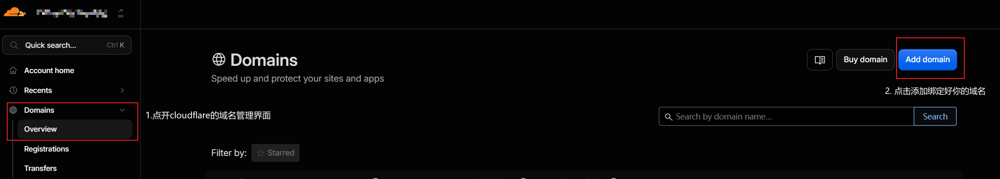
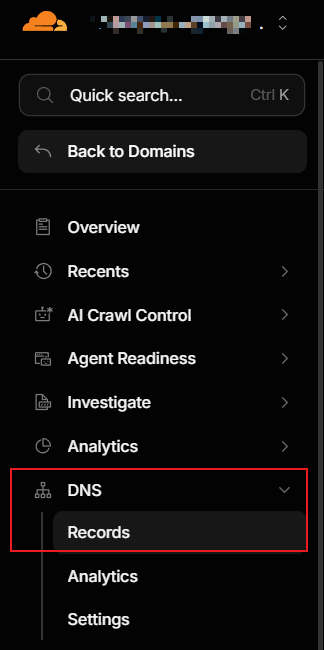
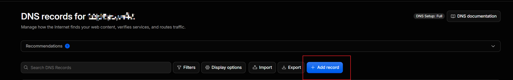
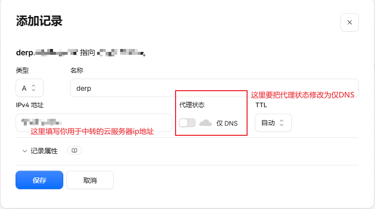
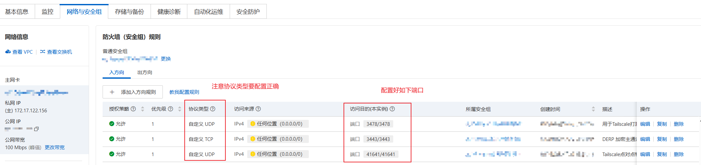
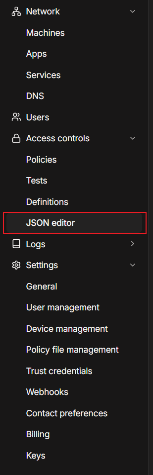
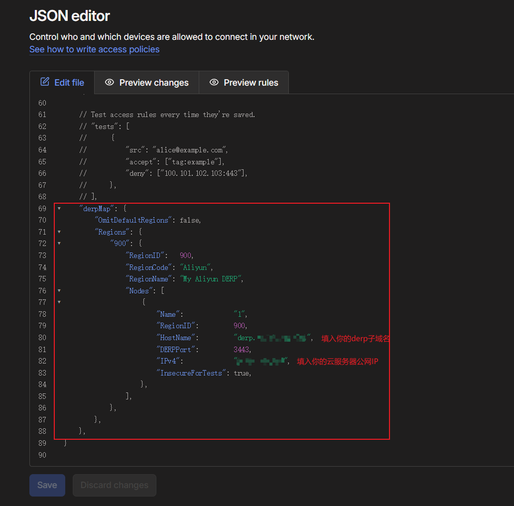

+++

title = '自建 Tailscale DERP 节点不完全指北'

date = '2026-08-11T14:11:52+08:00'
draft = false

+++

# 自建 Tailscale DERP 节点不完全指北

Tsk家里部署了一台私有服务器，负责相册备份。平时在局域网内用得很舒服，但一直没考虑过外网异地访问的问题。 最近了解到利用Tailscale组建虚拟局域网的方式来进行外网访问 安全性高还方便 正好还有一台学生优惠白嫖的2c2g阿里云服务器一直吃灰(懒狗懒得用bushi

**Tailscale** 优先走 P2P 直连，网络好的时候能跑满家里的上行带宽；可一旦P2P打洞失败，流量就会自动切到官方部署在海外的 DERP 中转节点，延迟 200ms+，速度显然无法接受。诶？ 正好我能把一台有公网 IP 的云服务器变成**私人专属的 DERP 节点**，大幅降低无法P2P打洞情况下的连接延迟。

本文记录完整的部署流程，包括如何做到"防白嫖"——只允许你自己网络里的设备使用这台中转站。


本文搭建特点： 无需备案 使用docker容器部署 部署方式简单

## 什么是 Tailscale？

Tailscale 是一款基于 WireGuard 协议的组网工具，它把"组建虚拟局域网"这件事简化到了极致：在每台设备上安装客户端、登录同一个账号，这些设备就会自动组成一张加密的私有虚拟网络（Mesh VPN），无论它们分散在家庭、公司还是不同的城市。

它的核心特点可以概括为：

- **零配置组网**：不需要公网 IP，也不需要去路由器上做端口转发；
- **端到端加密**：设备间的流量基于 WireGuard 加密，数据平面不依赖第三方明文中转；
- **跨平台**：Windows、macOS、Linux、Android、iOS 都有客户端，电视盒子也能装；
- **个人使用免费**：普通家庭用户基本够用。

理解 Tailscale 的架构，可以把它分成两个平面：

- **控制平面**：由官方协调服务器负责设备发现、密钥分发和访问策略下发，它不承载你的业务数据；
- **数据平面**：设备之间的数据流量会优先尝试 **P2P 直连**（通过 NAT 打洞建立点对点通道），打洞失败时再经 **DERP 中继服务器**转发。

DERP 全称是 *Designated Encrypted Relay for Packets*（数据包指定加密中继），也就是 Tailscale 内置的加密中继节点。问题恰恰出在这里：默认的中继节点部署在海外，对国内用户来说延迟高、速度慢。这正是我们接下来要自建专属 DERP 的原因。

## 为什么值得自建 DERP

Tailscale 的连接策略是"先直连，失败再中转"：

- **P2P 直连成功**：客户端之间点对点通信，跑满你家宽带的实际上行速度（30M-50M）；
- **打洞失败**：自动切换 DERP 中转，官方节点远在海外，延迟高、速度慢；
- **自建 DERP 之后**：打洞失败时流量无缝切换到你的云服务器，延迟通常只有 20-40ms，连接非常稳定。

也就是说，你同时拿到两种能力：网络好时满速直连，网络差时低延迟兜底。这就是"P2P 与中转完美结合"的含义。

## 架构与原理


防白嫖的核心设计：云服务器上同时运行 **Tailscale 客户端** 和 **DERP 容器**。容器通过挂载宿主机的 `tailscaled.sock` 与 Tailscale 进程通信。当有陌生设备试图连接你的 443 端口时，DERP 会去核对对方的公钥是否属于你的 Tailscale 网络——不在名单里，直接 `Connection Refused`。

## 快速开始

### 准备工作

1. ** 域名**

   购买好一个域名(域名购买可在阿里云、腾讯云处购买 个人使用没有必要买.com域名 啥便宜买啥就行)

   并准备一个子域名（如 `derp.yourdomain.com`），把 A 记录解析到云服务器的公网 IP 操作如下

   

   

   绑定好你的域名后 打开相应的域名管理界面 转到DNS管理界面

   

   

   

   在对应域名的DNS配置中 添加一条记录(这里我使用的是Cloudflare的DNS解析服务 如果使用其他服务请自行研究)

   

   



2. **云厂商安全组**

（以阿里云为例），放行三个端口：

TCP **3443**：用于 DERP 节点的加密流量转发 核心通信 加密主通道

*UDP* 3478：用于 Tailscale 的 STUN 测速打洞（千万不能配成 TCP 这里作者不小心配成TCP排查了好一会T-T）

*UDP* 41641：用于Tailscale打洞的端口




3. 云服务器需要能运行 Docker 和 Docker Compose 如何安装Docker和使用 Docker Compose 请自行搜索


### 第一步：云服务器加入你的 Tailscale 网络

云服务器和私有服务器分别执行以下命令 登录tailscale账号并绑定设备

```shell
curl -fsSL https://tailscale.com/install.sh | sh
sudo tailscale up
```

按提示完成登录后，云服务器就和家里的服务器处于同一个虚拟局域网了

### 第二步：部署 DERP 容器

在当前用户目录下创建一个文件夹(如tailscale-derp 来存放相关容器文件)

```shell
mkdir -p ~/tailscale-derp && cd ~/tailscale-derp 
nano docker-compose.yml # 创建docker-compose文件并编辑
```

粘贴以下内容（**记得替换自己的域名**）：

```yaml
services:
  derper:
    image: ghcr.io/yangchuansheng/derper:v1.98.8
    container_name: derper
    restart: always
    ports:
    - "3443:443"      # 避开国内强制备案拦截，将容器443映射到宿主机3443
    - "3478:3478/udp" # STUN 穿透打洞专用端口
    volumes:
      - /var/run/tailscale/tailscaled.sock:/var/run/tailscale/tailscaled.sock
      - ./certs:/app/certs
    environment:
      - DERP_DOMAIN=derp.yourdomain.com   # 替换为你的域名
      - DERP_VERIFY_CLIENTS=true          # 开启防白嫖验证
      - DERP_CERT_MODE=manual             # 手动申请 SSL 证书
```

保存并退出后

执行以下命令使用 OpenSSL 手动签发本地证书

```shell
mkdir -p ~/tailscale-derp/certs && cd ~/tailscale-derp
openssl req -x509 -newkey rsa:4096 -sha256 -days 3650 -nodes \
  -keyout certs/derp.你的域名.com.key -out certs/derp.你的域名.com.crt \
  -subj "/CN=derp.你的域名.com" -addext "subjectAltName=DNS:derp.你的域名.com"
```


  启动容器：

```shell
docker compose up -d
```

这里为了避免备案和阿里云的拦截 使用 OpenSSL 手动签发本地证书，避开常规 443 端口的 Let's Encrypt 验证限制

## 第三步：在 Tailscale 控制台注册你的节点

登录 Tailscale 管理后台，进入 **Access Controls** 页面；



在 JSON 配置的末尾（注意与前面的条目用逗号分隔）加入：

```json
"derpMap": {
  "OmitDefaultRegions": false,
  "Regions": {
    "900": {
      "RegionID": 900,
      "RegionCode": "Aliyun",
      "RegionName": "My Aliyun DERP",
      "Nodes": [
        {
          "Name": "1",
          "RegionID": 900,
          "HostName": "derp.yourdomain.com",
          "DERPPort": 443,
          "IPv4": "你的云服务器公网IP"
        }
      ]
    }
  }
}
```

点击 Save。官方服务器会把新的节点信息同步给所有客户端。




**关于 `OmitDefaultRegions`**：设为 `true` 会彻底禁用官方海外节点、强制只走你的云服务器；设为 `false` 则保留官方节点作为最后兜底。建议先用 `false` 测试，确认自己的节点稳定后再决定是否收紧。

## 第四步：验证是否生效

回到家庭服务器或笔记本上执行：

`tailscale ping <云服务器Tailscale IP>`

如果返回信息里带有 `via DERP(Aliyun)` 之类的字样，说明流量已经走你的专属中转通道了。也可以运行 `tailscale netcheck` 查看更详细的网络诊断信息。

## 总结

自建 DERP 节点 = 把"打洞失败后的兜底通道"从遥远的官方服务器搬到自己的云服务器上。它的价值在于两者兼得：P2P 成功时满速直连，失败时低延迟中转，全程自动切换，不需要手动干预。配合公钥校验机制，这台中转站只为你自己的网络服务，安全又省心。

如果你也有一台吃灰的云服务器和一个需要异地访问的家用服务器，为啥不试试呢（乐
