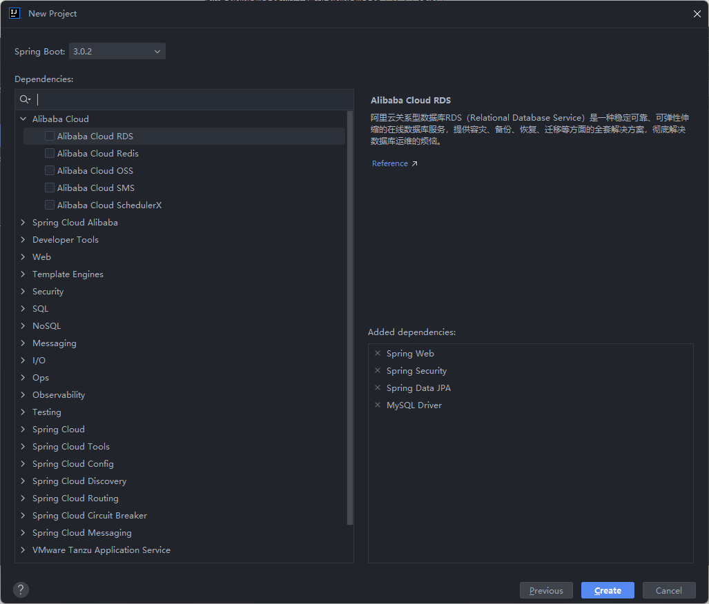

+++
date = '2026-01-04T22:42:24+08:00'
draft = true
title = '毕业设计-网络漏洞扫描与渗透测试平台'

+++

# springboot项目创建 

[springboot中文文档](https://www.spring-doc.cn/projects/spring-boot#overview)

[spring官方文档](https://spring.io/guides)

创建springboot项目 选择springboot 3.0.2 + jdk17

添加如下依赖

连接好数据库后创建数据库

