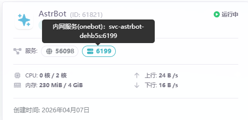

+++

title = 'Astrbot的配置使用与研究'

date = '2026-05-07T15:06:44+08:00'
draft = true

+++

# astrbot的配置使用与研究

## 相关链接

[astrbot官方文档](https://docs.astrbot.app/)

[napcat官方文档](https://napneko.github.io/)

[雨云云服务官网](https://app.rainyun.com/)


## 使用雨云的云应用服务部署

特别注意 使用雨云云应用部署时 对应的内网服务url如下图


在napcat的网络配置下 添加Websocket客户端的url应填入`ws://svc-astrbot-dehb5s:6199/ws`


## 使用阿里云服务器部署

使用ssh连接到云服务器 `ssh root@你的公网IP地址`


参考[AstrBot安装使用指南（终极版)](https://www.bilibili.com/video/BV13rXKBPEFb/?spm_id_from=333.337.search-card.all.click&vd_source=bebe80cfa65c7db1ab5baf08c2d68493)


## 使用本地linux部署

本文使用 Windows11 下的 Wsl2 安装`Ubuntu22.04`进行部署


### 安装docker

1. 更新apt包索引并安装依赖包

```bash
sudo apt-get update
sudo apt-get install \
    ca-certificates \
    curl \
    gnupg \
    lsb-release
```

2. 添加 Docker 的官方 GPG 密钥

```bash
sudo mkdir -m 0755 -p /etc/apt/keyrings
curl -fsSL https://download.docker.com/linux/ubuntu/gpg | sudo gpg --dearmor -o /etc/apt/keyrings/docker.gpg
```

3. 设置 Docker 仓库

```bash
echo \
  "deb [arch=$(dpkg --print-architecture) signed-by=/etc/apt/keyrings/docker.gpg] https://download.docker.com/linux/ubuntu \
  $(lsb_release -cs) stable" | sudo tee /etc/apt/sources.list.d/docker.list > /dev/null
```

4. 安装 Docker Engine

```bash
sudo apt-get update
sudo apt-get install docker-ce docker-ce-cli containerd.io docker-buildx-plugin docker-compose-plugin
```

5. 配置Docker镜像源

```bash
sudo mkdir -p /etc/docker
sudo nano /etc/docker/daemon.json


填入以下内容
{
  "registry-mirrors": [
    "https://docker.m.daocloud.io",
    "https://docker.nju.edu.cn",
    "https://mirror.baidubce.com"
  ]
}

重新读取配置并重启 Docker 服务
sudo systemctl daemon-reload
sudo systemctl restart docker

测试是否安装成功
sudo docker run hello-world
```

### 使用docker部署

参考[Astrbot Docker部署方式](https://docs.astrbot.app/deploy/astrbot/docker.html)

