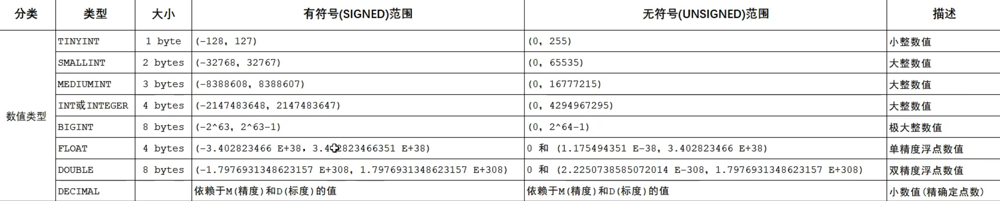
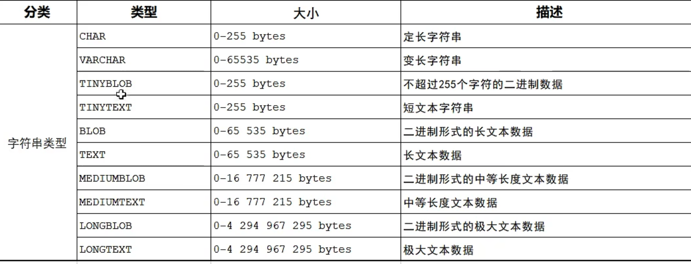
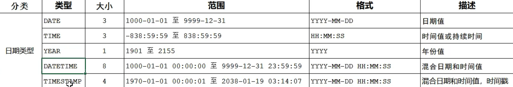
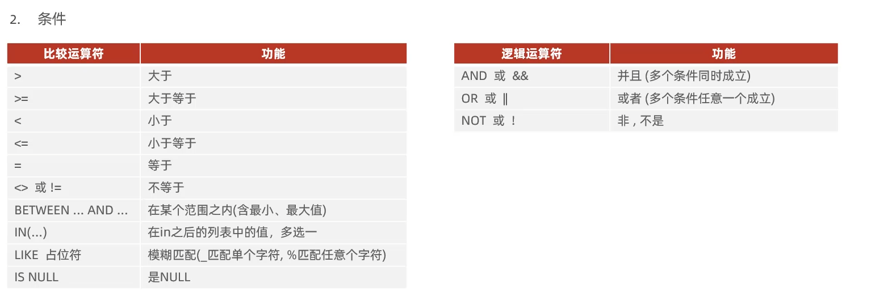
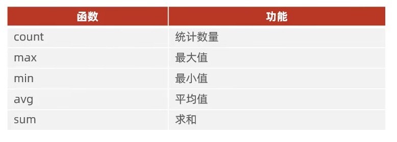

+++
date = '2026-01-05T23:52:00+08:00'
draft = false
title = 'Mysql基础操作'

+++

# MySql

cmd连接本地数据库`mysql -u '用户名' -p`


## 数据类型








---


---

## **SQL分类**


## DDL(Data Definition Language 数据定义语言)

```sql
SHOW DATABASES; # 查询所有数据库
SELECT DATABASE(); # 查询当前数据库
CREATE DATABASE [IF NOT EXISTS] 数据库名 [DEFAULT CHARSET 字符集] [COLLATE 排序规则]; # 创建数据库
DROP DATABASE [IF EXISTS] 数据库名 # 删除数据库
USE 数据库名 # 使用数据库
```

查询表定义信息

```sql
SHOW TABLES; # 查询当前数据库所有表
DESC 表名 # 查询表结构
SHOW CREATE TABLE 表名 # 查询指定表的建表语句
```

创建表

```sql
CREATE TABLE 表名(  # 创建表
    字段1 字段1类型 [COMMENT 注释1],
    字段2 字段2类型 [COMMENT 注释2],
    字段3 字段3类型 [COMMENT 注释3] # 注意最后一个没有逗号
    ...
    [constraint][外键名称] foreign key(外键字段名) references 主表(字段名)
	)[COMMENT 表注释] ;
```

修改表数据

```sql
ALTER TABLE 表名 ADD 字段名 类型(长度) [COMMENT 注释] [约束]; # 添加字段
ALTER TABLE 表名 MODIFY 字段名 新数据类型(长度) # 修改数据类型
ALTER TABLE 表名 CHANGE 旧字段名 新字段名 类型(长度) [COMMENT 注释] [约束]; # 修改字段名和数据类型
ALTER TABLE 表名 DROP 字段名; # 删除字段
ALTER TABLE 表名 RENAME TO 新表名 # 修改表名
ALTER TABLE 表名 add constraint 外键名称 foreign key(外键字段名) reference 主表(字段名);
```

删除表

```SQL
DROP TABLE [IF EXISTS] 表名; # 删除表
TRUNCATE TABLE 表名; # 删除指定表 并重新创建该表 (清空)
```

约束


---


## DML(Data Manipulation Language 数据操作语言)

表插入数据

```sql
INSERT INTO 表名 (字段名1, 字段名2, ...) VALUES(值1, 值2, ...); # 给指定字段添加数据
INSERT INTO 表名 VALUES(值1, 值2, ...); # 给全部字段添加数据
# 批量添加数据
INSERT INTO 表名 (字段1, 字段2, ...) VALUES(值1, 值2, ...), (值1, 值2, ...), (值1, 值2, ...);
INSERT INTO 表名 VALUES (值1, 值2, ...), (值1, 值2, ...), (值1, 值2, ...);
```

表修改数据

```sql
UPDATE 表名 SET 字段名1 = 值1, 字段名2 = 值2, ...[WHERE 条件]; # 修改数据 
```

表删除数据

```SQL
DELETE FROM 表名 [WHERE 条件]; # 删除数据 如果没有条件会删除整张表的所有数据
```


---


## DQL(Data Query Language 数据查询语言)

**编写顺序**

```SQL
SELECT 			# 4
	字段列表
FROM			# 1
	表名列表
WHERE			# 2
	条件列表 
GROUP BY		# 3
	分组字段列表	
HAVING			
	分组后条件列表
ORDER BY		# 5
	排序字段列表
LIMIT			# 6
	分页参数
```

1. ### 基本查询

```sql
SELECT 字段1, 字段2, 字段3 ... FROM 表名;
SELECT * FROM 表名;  # 查询多个字段

SELECT 字段1[AS 别名1], 字段2[AS 别名2] ... 表名; # 设置别名

SELECT DISTINCT 字段列表 FROM 表名; # 去除重复记录
```

2. ### 条件查询

```SQL
SELECT 字段列表 FROM 表名 WHERE 条件列表;
```



3. ### 聚合函数

```SQL
SELECT 聚合函数(字段列表) FROM 表名;
SELECT sum(age) FROM emp WHERE ID IS NOT NULL; # 例
```



4. ### 分组查询

```sql
SELECT 字段列表 FROM 表名 [WHERE 条件] GROUP BY 分组字段名 [HAVING 分组后过滤条件];  
SELECT gender, count(*) FROM emp GROUP BY gender; # 例 统计男性员工和女性员工的数量 
SELECT workaddress, count(*) FROM emp WHERE age < 45 GROUP BY workaddress HAVING count(*) >= 3;
	# 例 查询年龄小于45岁的员工,并根据工作地址分组,获取员工数量大于等于3的工作地址
	
#一般带group by的分组查询 字段列表为 分组字段名 + 聚合函数 
```


5. ### 排序查询

```sql
SELECT 字段列表 FROM 表名 ORDER BY 字段1 排序方式1 ， 字段2 排序方式2; # ASC 升序(默认值) DESC 降序
# 多字段排序当第一个字段值相同时，才会根据第二个字段排序
```

6. ### 分页查询

```sql
SELECT 字段列表 FROM 表名 LIMIT 起始索引 查询记录数;
```

## DCL（Data Control Language 数据控制语言）

1. 查询用户

```sql
USE mysql; # 用户信息存放在mysql数据库中
SELECT * FROM user;
```

2. 创建用户

```SQL
CREATE USER '用户名' @ '主机名' IDENTIFIED BY '密码';  # 主机名localhost为本机 %为任意主机
```

3. 修改用户密码

```SQL
ALTER USER '用户名'@ '主机名' IDENTIFIED WITH mysql_native_password BY '密码'; 
```

4. 删除用户

```sql
DROP USER '用户名' @ '主机名';
```


1. 查询权限

```sql
SHOW GRANTS FOR '用户名' @ '主机名';
```

2. 授予权限

```sql
GRANT 权限列表 ON 数据库名.表名 TO '用户名' @ '主机名';
```

3. 撤销权限

```sql
REVOKE 权限列表 ON 数据库名.表名 FROM '用户名' @ '主机名'; # 多个权限之间使用,分隔
```

